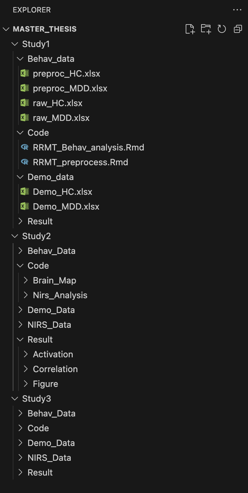

# fNIRS Neurofeedback Intervention in Adolescent Depression
* Name: Zheng Xia
* Student ID: 15984230

---

## 1. Motivation
This project investigates the neural and behavioral mechanisms underlying neurofeedback (NF) interventions in adolescents with depression. Using functional near-infrared spectroscopy (fNIRS), the study aims to evaluate whether self-regulation of prefrontal activation can enhance reward processing(measured by the behavioral task RRMT) and reduce depressive symptoms.

The research contributes to the growing literature on neurofeedback-based interventions for affective disorders, focusing on the feasibility and effectiveness of real-time fNIRS feedback training.

---

## 2. Overview of Studies

| Study | Description | Main Data | Key Outputs |
|:------|:-------------|:-----------|:-------------|
| **Study 1: Behavioral Analysis** | Examines behavioral differences in reward processing between depressed and healthy adolescents. | Behavioral and demographic data | Statistical test results, group comparison plots |
| **Study 2: Activation Analysis** | Applys fNRIS to explore the brain activation differences during reward processing period between the depressed and healthy adolescents | Behavioral data and fNIRS activation data | Per-channel activation trends, statistical test results, correlation between behavioral and neural data|
| **Study 3: Training Effects Evaluation** | Compares pre–post changes in activation and symptom scores to assess NF intervention effects. | Session-wise activation values, post-training fNIRS and self-report data | ΔActivation summary tables, statistical test results |

---

## 3. Folder Structure and Content

The project is organized into three main studies, each corresponding to a different stage of the research.  
All analyses are written in R, and the folder hierarchy is designed to separate raw data, processed data, scripts, and outputs clearly.

<p align="center">
  
</p>


### Folder Descriptions
#### **Study1 – Behavioral Analysis**
- **Behav_data/** – raw and preprocessed Excel files for both groups (`raw_HC.xlsx`, `raw_MDD.xlsx`, `preproc_HC.xlsx`, `preproc_MDD.xlsx`).  
- **Code/** – R Markdown scripts for preprocessing (`RRMT_preprocess.Rmd`) and statistical/visual analysis (`RRMT_Behav_analysis.Rmd`).  
- **Demo_data/** – demographic datasets.  
- **Result/** – generated figures and summary tables of behavioral outcomes.

#### **Study2 – Activation Analysis**
- **Behav_Data/** – behavioral performance measured by the task which is in the same format as Study 1.  
- **NIRS_Data/** – preprocessed fNIRS activation data during the task.  
- **Code/** – R scripts for both signal-level and brain-mapping analyses:
  - **Brain_Map/** – code for visualizing cortical activation maps.  
  - **Nirs_Analysis/** – code for modeling activation using GLM or mixed models.  
- **Demo_Data/** – demographic datasets. 
- **Result/** –  
  - **Activation/** – activation statistics and channel-level results.  
  - **Correlation/** – correlation analyses between activation and behavioral measures.  
  - **Figure/** – plots and visualization outputs.

#### **Study3 – Training Effects**
- **Behav_Data/** – behavioral performance measured by the task which is in the same format as Study 1. 
- **NIRS_Data/** – session-level and run-level activation data across the eight NF sessions. 
- **Code/** – scripts for modeling learning curves and pre–post changes.  
- **Demo_Data/** – demographic datasets. 
- **Result/** – figures and summary tables showing changes across sessions.

---

## 4. Environment Setup
Developed in **R 4.3.2**

Required packages:
```r
tidyverse, lme4, pbivnorm, ggplot2, cowplot, reshape2, readxl


